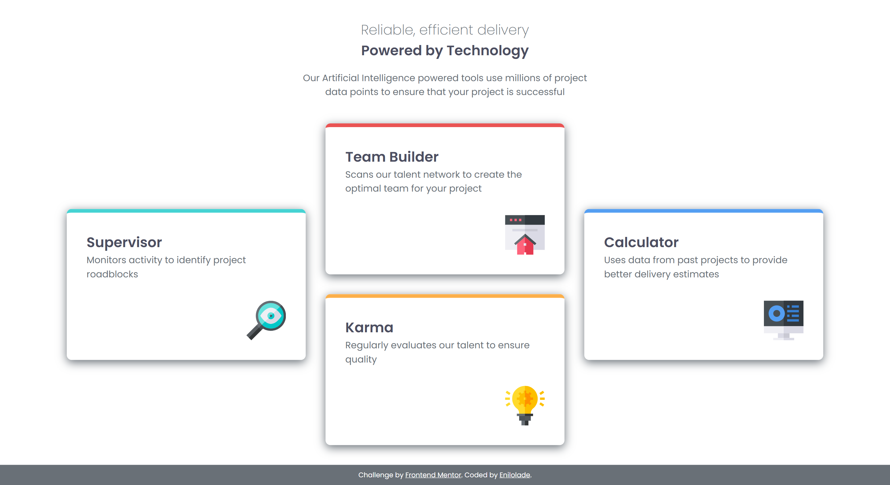
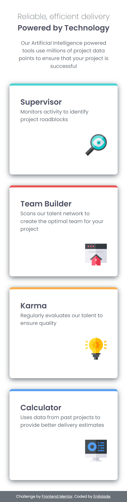

# Frontend Mentor - Four card feature section solution

This is a solution to the [Four card feature section challenge on Frontend Mentor](https://www.frontendmentor.io/challenges/four-card-feature-section-weK1eFYK). Frontend Mentor challenges help you improve your coding skills by building realistic projects.

## Table of contents

- [Overview](#overview)

  - [The challenge](#the-challenge)
  - [Screenshot](#screenshot)
  - [Links](#links)

- [My process](#my-process)

  - [Built with](#built-with)
  - [What I learned](#what-i-learned)
  - [Continued development](#continued-development)
  - [Useful resources](#useful-resources)

- [Author](#author)

## Overview

### The challenge

Users should be able to:

- View the optimal layout for the site depending on their device's screen size

### Screenshot




### Links

- [Solution URL](https://github.com/Enilolade/four-card-feature)
- Live Site URL: [Add live site URL here](https://your-live-site-url.com)

## My process

### Built with

- Semantic HTML5 markup
- CSS custom properties
- Flexbox
- CSS Grid
- Mobile-first workflow
- Google Fonts (Poppins)

### What I learned

This project helped me improve my understanding of:

- **CSS Grid** and how to use `grid-template-areas` and `grid-row`/`grid-column` for layout adjustments across screen sizes.
- **Responsive design** using media queries to adjust layout and text widths for desktop screens.
- Using **CSS custom properties (variables)** to maintain consistent color theming and easily manage design updates.

Example snippet of grid layout for larger screens:

```css
@media screen and (min-width: 1024px) {
  .content {
    grid-template-columns: repeat(3, 1fr);
    grid-template-rows: repeat(4, 1fr);
  }

  .green-card {
    grid-column: 1 / 2;
    grid-row: 2 / 4;
  }

  .red-card {
    grid-column: 2 / 3;
    grid-row: 1 / 3;
  }

  .orange-card {
    grid-column: 2 / 3;
    grid-row: 3 / 5;
  }

  .blue-card {
    grid-column: 3 / 4;
    grid-row: 2 / 4;
  }
}
```

### Continued development

I want to continue refining my CSS Grid and Flexbox skills, particularly for more complex layouts. I also plan to practice using ARIA roles and accessibility best practices in future projects.

### Useful resources

- [CSS Tricks: A Complete Guide to Grid](https://css-tricks.com/snippets/css/complete-guide-grid/) – This resource helped me structure the grid layout effectively.
- [MDN Web Docs - Responsive design](https://developer.mozilla.org/en-US/docs/Learn/CSS/CSS_layout/Responsive_Design) – Helped me understand how to create layouts that adapt well across screen sizes.

## Author

- Frontend Mentor - [@enilolade](https://www.frontendmentor.io/profile/enilolade)
